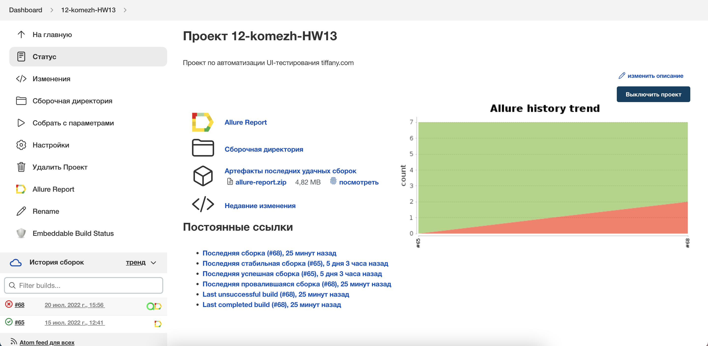
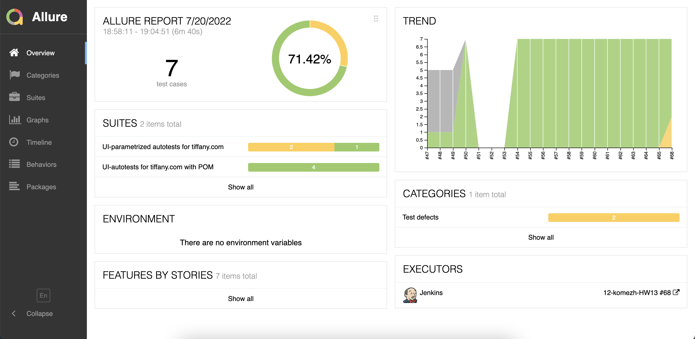
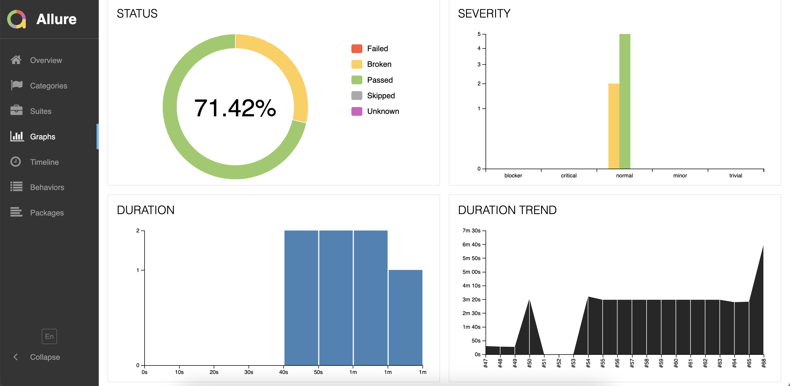
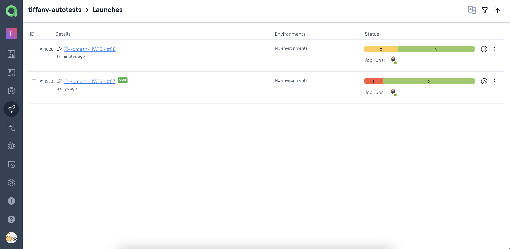
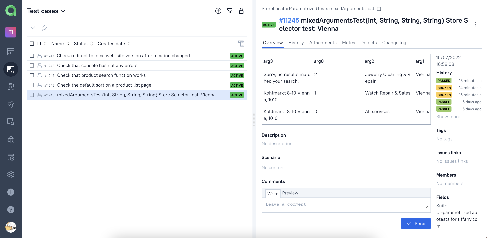
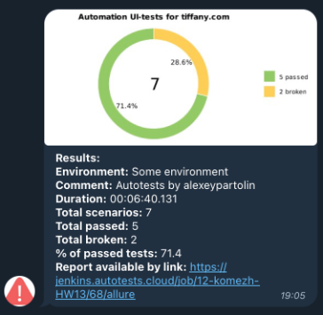

# Автоматизированное тестирование сайта Tiffany&Co

## :page_with_curl:    Содержание

➠ [Покрытый функционал](#globe_with_meridians-покрытый-функционал)

➠ [Технологический стек](#computer-технологический-стек)

➠ [Запуск тестов из терминала](#technologist-запуск-тестов-из-терминала)

➠ [Удаленный запуск тестов](#удаленный-запуск-тестов)

➠ [Сборка в Jenkins](#-главная-страница-сборки-Jenkins)

➠ [Отчет о результатах тестирования в Allure Report](#-отчет-о-результатах-тестирования-в-allure-report)

➠ [Интеграция с Allure TestOps](#-интеграция-с-allure-testops)

➠ [Уведомления в Telegram с использованием бота](#-уведомления-в-telegram-с-использованием-бота)

➠ [Пример запуска теста в Selenoid](#-пример-запуска-теста-в-selenoid)

## <a name="globe_with_meridians-покрытый-функционал"></a>:globe_with_meridians: Покрытый функционал

### UI
- [x] Проверка установленной сортировки по-умолчанию среди товаров (тесты с Page Object)
- [x] Проверка выдачи необходимой информации о магазине исходя из значений входных данных (Параметризированные тесты)
- [x] Проверка функциональности поиска продукта по его имени
- [x] Проверка редиректа на локальную версию веб-сайта
- [x] Проверка на отсутствие ошибок в журнале консоли страницы

## :computer: Технологический стек

<p align="center">


</p>

В данном проекте автотесты написаны на <code>Java</code> с использованием <code>Selenide</code> для UI-тестов.

> В качестве библиотеки для модульного тестирования используется <code>JUnit 5</code>.
>
> Для автоматизированной сборки проекта используется <code>Gradle</code>.
>
> <code>Selenoid</code> выполняет запуск браузеров в контейнерах <code>Docker</code>.
>
> <code>Allure Report</code> формирует отчет о запуске тестов.
>
> <code>Jenkins</code> выполняет запуск тестов.
>
> После завершения прогона отправляются уведомления с помощью бота в <code>Telegram</code>.

## :technologist: Запуск тестов из терминала

### Локальный запуск тестов

```
gradle clean test
```

### Удаленный запуск тестов

```
clean
test
-Dbrowser=${BROWSER}
-Dversion=${VERSION}
-Dsize=${BROWSER_SIZE}
```

### Параметры сборки

> <code>BROWSER</code> – браузер, в котором будут выполняться тесты (_по умолчанию - <code>chrome</code>_).
>
> <code>VERSION</code> – версия браузера, в которой будут выполняться тесты (_по умолчанию - <code>91.0</code>_).
>
> <code>BROWSER_SIZE</code> – размер окна браузера, в котором будут выполняться тесты (_по умолчанию - <code>1920x1080</code>_).

##  Главная страница сборки [Jenkins](https://jenkins.autotests.cloud/job/12-komezh-HW13)

<p align="center">
  
</p>

##  Отчет о результатах тестирования в [Allure Report](https://jenkins.autotests.cloud/job/12-komezh-HW13/68/allure/)

### :pushpin: Главная страница Allure-отчета

<p align="center">

</p>

### :pushpin: Основной дашборд

<p align="center">

</p>

##  Интеграция с [Allure TestOps](https://allure.autotests.cloud/launch/14628)

### :pushpin: Страница с запусками

<p align="center">
  
</p>

### :pushpin: Страница с тестами

<p align="center">
  
</p>

##  Уведомления в Telegram с использованием бота

> После завершения сборки бот, созданный в <code>Telegram</code>, автоматически обрабатывает и отправляет сообщение с отчетом.
<p align="center">

</p>

##  Пример запуска теста в Selenoid

> К каждому тесту в отчете прилагается видео. Одно из таких видео представлено ниже.

